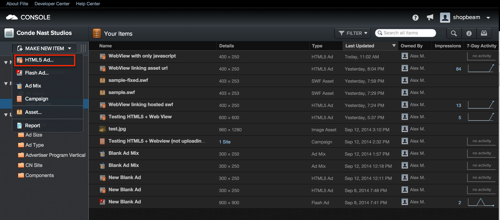
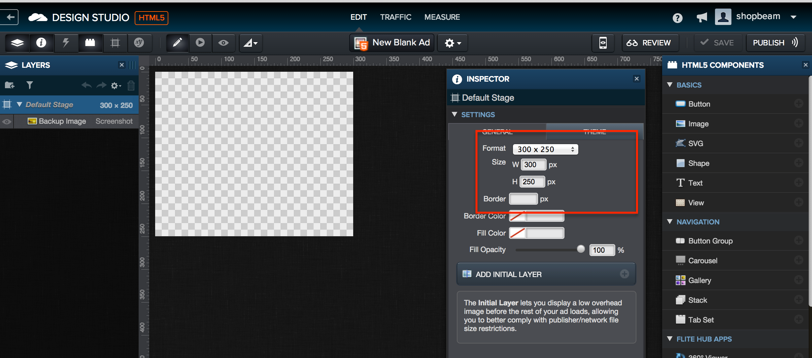
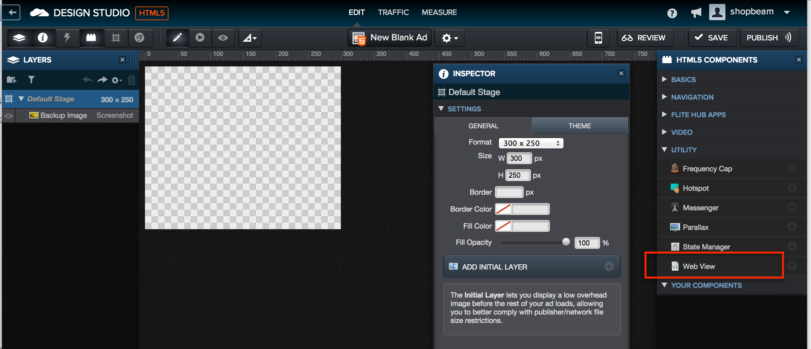
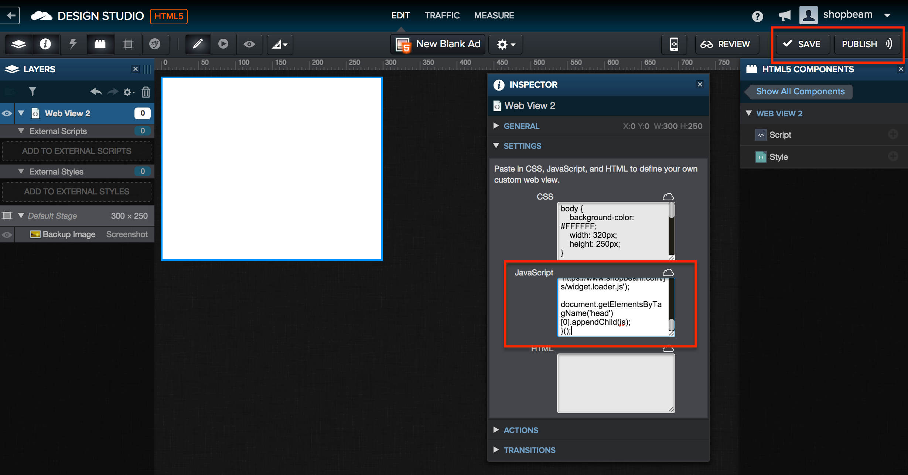
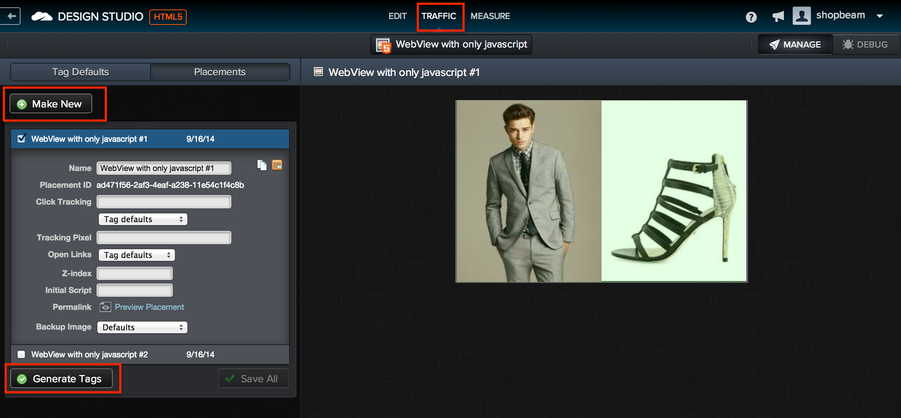
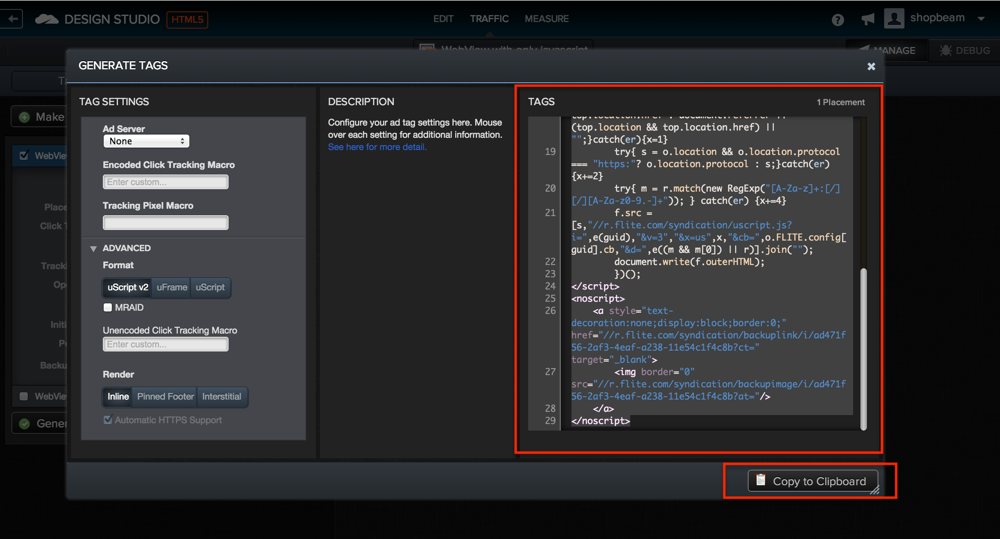

Shopbeam Overview
-----

Shopbeam provides tools for advertisers and publishers to create and serve display advertisements which load product detail windows on-site. These on-publisher site product detail modal windows can be used to add products to a cross site shopping cart and purchase these products without clicking away from host/publisher website.

####The Shopbeam Widget

The Shopbeam 'widget' is the element that is embedded onto a hosting site's page or served over an ad network which the user can interact with to begin their on-site shopping experience. The Shopbeam widget can be either an html image made active with javascript or a flash swf. The instructions below are for creating and embedding a flash swf Shopbeam widget.

Usage
-----

####Linking MovieClips to Shopbeam products

In "YourDocumentClass" file instantiate the Shopbeam library with your API key. Once instantiated call the onClickGoToProduct function of your Shopbeam object passing the MovieClip name and product ID as arguments to wire up a MovieClip to the Shopbeam product lightbox like:

``` as
import com.shopbeam.*;

public class YourDocumentClass extends MovieClip {

  public function YourDocumentClass() { 

    var shopbeam:Shopbeam = new Shopbeam("YOUR-API-KEY", this);

    // first argument is a MovieClip name, the second argument is a product ID
    shopbeam.onClickGoToProduct("movieClip1", "product1-id");

    // optional additional call to wire up another MovieClip
    shopbeam.onClickGoToProduct("movieClip2", "product2-id");

  }

}
```

You can find the com.shopbeam Actionscript library source file in the example on this repo  here: https://raw.githubusercontent.com/yaplas/yaplas.github.io/master/com/shopbeam/Shopbeam.as.

In order for MovieClips to link to Shopbeam products, ensure your MovieClips have instance names (for the example above: movieClip1 and movieClip2). Once you have your MovieClip instance name you need a product ID to pair with it. To get a product ID search http://www.shopbeam.com/products for the product you'd like to link to and obtain the product ID for that product from the product detail modal on that page on the tab titled 'Product ID'.

> For testing purposes you can login to https://www.shopbeam.com/products using the credentials:
>
> Email: widgetExample@shopbeam.com  
> Password: widgetExample

Once you have both a MovieClip instance name and a product ID you can call the Actionscript function `shopbeam.onClickGoToProduct` passing your MovieClip instance name and the product ID as function arguments which will make those MovieClips link to products in Shopbeam on-site product lightboxes. 

####Embedding your Shopbeam enabled SWF

Two page elements are required for a Shopbeam enabled swf to successfully launch product detail modals. One is the `<script>` tag with the Shopbeam Javascript library. 

```html
<script class="shopbeam-script" type="text/javascript" src="https://www.shopbeam.com/js/widget.loader.js" async="true"></script>
```
> Note: The Shopbeam Javascript library can be loaded using methods other then embedding a `<script>` element directly in the page. A Friendly iFrame loader or using a partner embed as a bootstraper are two examples of alternative Shopbeam Javascript library load mechanisms. What is required is that the Shopbeam Javascript library is loaded using some mechanism into the top level page of the site as well as the frame (if it's in a separate frame) where the `<object>` tag is located. 

The other html element required is the `<object>` tag for the SWF file:

```html
<object type="application/x-shockwave-flash" data="[[swf-file-name.swf]]"
  id="shopbeam-widget-swf-unbootstrapped-[[UUID]]"
  width="[[900]]" height="[[500]]">
  <param name="movie" value="[[swf-file-name.swf]]"/>
  <param name="FlashVars" value="widgetUuid=[[UUID]]"/>
  <param name="allowscriptaccess" value="always"/>
</object>
```

> Characters in brackets [] require embed instance specific values, final values will have no brackets []. 

The only Shopbeam requirements for the `<object>` embed are an `id=` attribute value in a specific format and the `widgetUuid=` FlashVar. Both these embed requirements make use of a widget embed unique identifier.

#### UUID can be any value unique to other Shopbeam widget UUIDs on the page

A unique identifier for each widget embed is required and is referred to as a `UUID`. The value of the UUID for one instance of an Shopbeam widget embed can be any series of characters as long as it is unique to the page from other Shopbeam widget embed's unique identifiers. If your widget is being served on a page you do not fully control, such as through an ad network, the UUID for your embed would need to be a globally unique identifier such as a Guid to avoid any potential conflicts with other Shopbeam embeds. 

> You can generate you're own Guid using any Guid generator for example: http://www.guidgenerator.com/


A working example of a Shopbeam Flash Widget embed can be found here: http://yaplas.github.io/.

### AD Networks Usage

#### Flite

1. In your Flite dashboard add a new "HTML5 Ad" item.

  

2. Set Width and Height the same as in your flash project.

  
  
3. Add a WebView component in the body, set the same width and height if it were necesary.

  

4. Paste this code into the WebView Javascript textarea:
  
  ```js
  !function() {
    function setParam(obj, name, value) {
        var prm = document.createElement('param');
        prm.setAttribute('name', name);
        prm.setAttribute('value', value);
        obj.appendChild(prm);
    }
  
    var swf = document.createElement('object');
    swf.setAttribute('type', 'application/x-shockwave-flash');
    swf.setAttribute('data', '[[swf-file-url.swf]]');
    swf.setAttribute('id', 'shopbeam-widget-swf-unbootstrapped-[[UUID]]');
    swf.setAttribute('width', '[[400]]');
    swf.setAttribute('height', '[[250]]');
    setParam(swf, 'movie', '[[swf-file-url.swf]]');
    setParam(swf, 'FlashVars', 'widgetUuid=[[UUID]]');
    setParam(swf, 'allowscriptaccess', 'always');
    document.body.appendChild(swf);
  
    var js = document.createElement('script');
    js.setAttribute('type', 'text/javascript');
    js.setAttribute('class', 'shopbeam-script');
    js.setAttribute('src', 'https://www.shopbeam.com/js/widget.loader.js');
    document.getElementsByTagName('head')[0].appendChild(js);
  }();
  ```
  > Characters in brackets [] require embed instance specific values, final values will have no brackets []. 

5. Save and Publish

  

6. Click on TRAFFIC on the top of the page, then click on Placements, click on Make New, and then Generate Tags.

  

7. Copy the tags code, and paste in the page you want to publish the AD.

  

You can find a working example here <http://yaplas.github.io/flite-javascript-only.html>

#### Doubleclick 

Double Click for Publishers Shopbeam Custom SWF Creative Instructions

1. Go to "Creatives" section
2. Click "Add creatives"
3. Select appropriate "Advertiser"
4. Select "Third party" type
5. Apply an appropriate "Name" to creative
6. Paste the following code into "Code snippet" area:

  ```html
  <script type="text/javascript">
    !function() {
      function setParam(obj, name, value) {
          var prm = document.createElement('param');
          prm.setAttribute('name', name);
          prm.setAttribute('value', value);
          obj.appendChild(prm);
      }
    
      var swf = document.createElement('object');
      swf.setAttribute('type', 'application/x-shockwave-flash');
      swf.setAttribute('data', '[[swf-file-url.swf]]');
      swf.setAttribute('id', 'shopbeam-widget-swf-unbootstrapped-[[UUID]]');
      swf.setAttribute('width', '[[400]]');
      swf.setAttribute('height', '[[250]]');
      setParam(swf, 'movie', '[[swf-file-url.swf]]');
      setParam(swf, 'FlashVars', 'widgetUuid=[[UUID]]');
      setParam(swf, 'allowscriptaccess', 'always');
      document.body.appendChild(swf);
    
      var js = document.createElement('script');
      js.setAttribute('type', 'text/javascript');
      js.setAttribute('class', 'shopbeam-script');
      js.setAttribute('src', 'https://www.shopbeam.com/js/widget.loader.js');
      document.getElementsByTagName('head')[0].appendChild(js);
    }();
  </script>
  ```
  > Characters in brackets [] require embed instance specific values, final values will have no brackets []. 

7. Select appropriate "Target ad unit size"
8. Click "Save"
9. Now you can preview Shopbeam Ad by selecting "Preview: New window"
10. Add appropriate "Line Items" to this creative to begin serving advertisement
